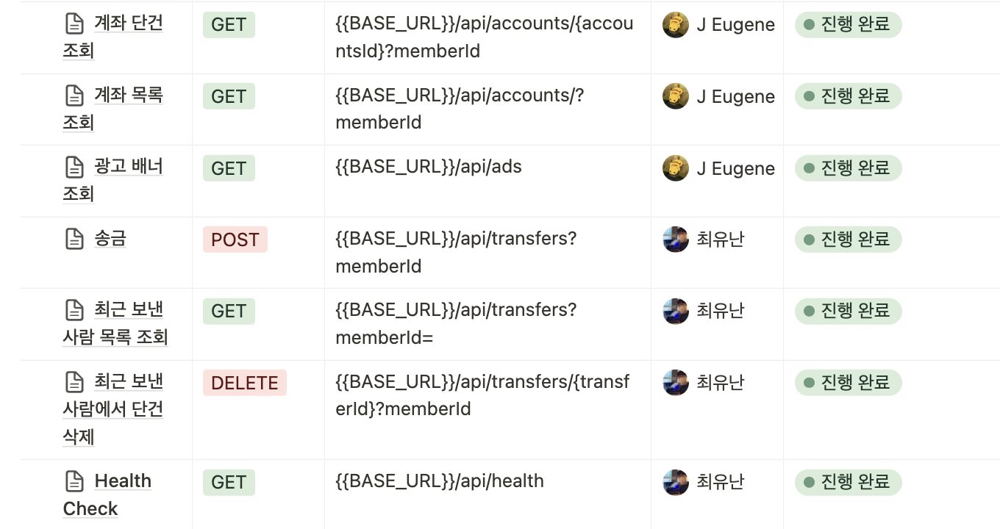

## GO SOPT 합동세미나 Server Repository 입니다.
## SOLSOL server
### Our Team
- [최윤한](https://github.com/unanchoi)
- [장유진](https://github.com/jinchiim)

## API 명세서


## 프로젝트 구조
- src
    - main
        - java
            - com.sopt.solsol
                - common
                - config
                - controller
                - domain
                - dto
                - exception
                - repository
                - service
                - util
                - SolsolApplication.java
        - resources
            - application.yml
    - test
        - java
            - com.sopt.solsol
                - SolsolApplicationTests.java
        - resources
            - application.yml

## 실행 방법
```bash

git clone https://github.com/GO-SOPT-SOLSOL/SOLSOL-server.git

cd SOLSOL-server

./gradlew clean build

cd build/libs

java -jar SOLSOL-0.0.1-SNAPSHOT.jar
```
